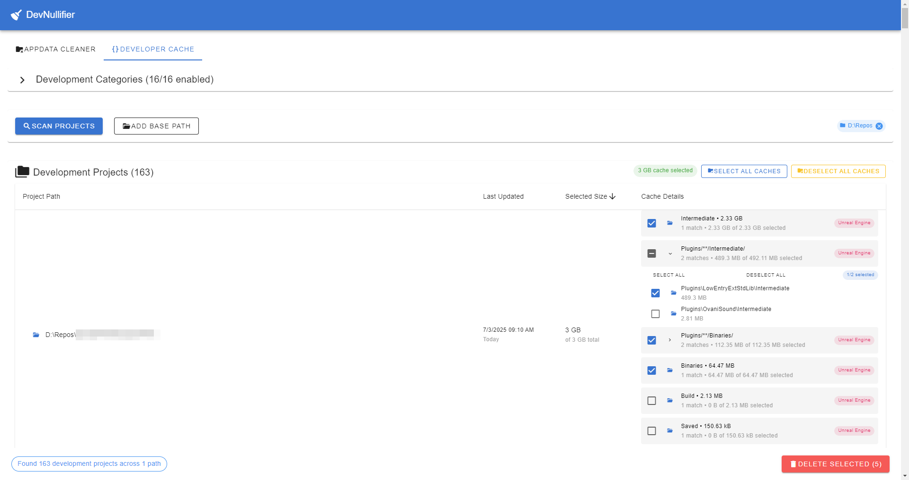
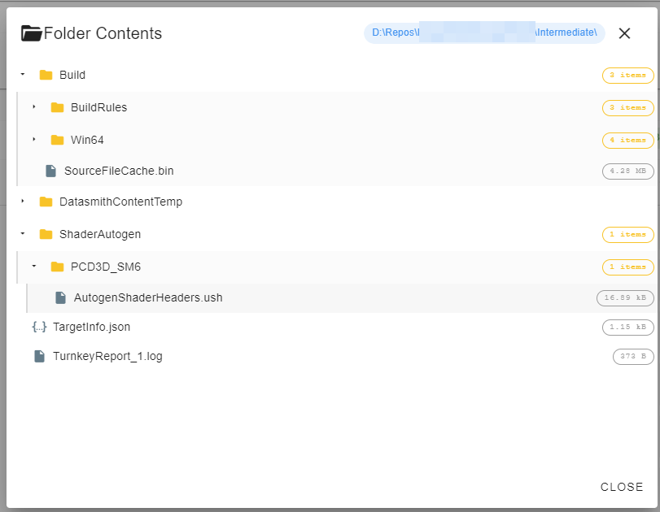

# DevNullifier

[](LICENSE)


I was tired of cleaning up my computer manually, so I made this app to help me.

Works for projects like:


Platforms:

[](https://github.com/Hermesiss/DevNullifier/releases/latest/download/DevNullifier-Setup.exe)
[-FCC624?style=flat&logo=linux&logoColor=black>)](https://github.com/Hermesiss/DevNullifier/releases/latest/download/DevNullifier-linux-x64.AppImage)
[](https://github.com/Hermesiss/DevNullifier/releases/latest/download/DevNullifier-linux-x64.deb)
[](https://github.com/Hermesiss/DevNullifier/releases/latest/download/DevNullifier-mac-x64.dmg)

Now with dark mode!

## Download

Download the latest release from the [Releases](https://github.com/Hermesiss/DevNullifier/releases) page.

## Application Data Cleaner


Cleans application data folders that accumulate temporary files, caches, and junk data.

- **Smart Scanning**: Recursively scans for cache, temp, and junk files
- **Size Visualization**: Shows folder sizes with human-readable formatting
- **Selective Deletion**: Choose exactly which folders to delete
- **Configurable Depth**: Control scanning depth with slider

**Targets:**

- **Windows**: Temp folders, cache folders, crash dumps, pending files, log files in AppData (Local, Roaming, LocalLow)
- **Linux**: Cache and temp folders in ~/.config, ~/.cache, ~/.local/share, ~/.local/state, /tmp
- **macOS**: Cache and temp folders in ~/Library/Caches, ~/Library/Application Support, ~/Library/Logs

## Dev Cleaner





Cleans development-related temporary folders that consume significant disk space.

- **Pattern-Based Filtering**: Filter folders by name patterns
- **Category Filtering**: Filter folders by category
- **Deep Scanning**: Scan through project directories

**Targets:**

- **node_modules**: Node.js dependencies (restorable with `npm install`)
- **.cache**: Application caches (Babel, ESLint, etc.)
- **Library/Binary/Intermediate**: Unity and build artifacts
- **Build folders**: Target, dist, build directories
- **Package manager caches**: npm, yarn, pip caches

**Features:**

- Pattern-based detection with configurable patterns
- Category filtering (cache, modules, builds, etc.)
- Deep scanning through project directories
- Safe deletion of regenerable folders

## Technology Stack

- **Electron**: Cross-platform desktop framework
- **Vue 3**: Progressive JavaScript framework with Composition API
- **Vuetify 3**: Material Design component library
- **Node.js**: File system operations and scanning logic

## Development

### Prerequisites

- Node.js 18 or higher
- npm or yarn

### Installation

**Using npm:**

```bash
npm install    # Install dependencies
npm run dev    # Run in development
npm run build  # Build for production
```

**Using Windows batch files:**

```cmd
setup.bat  # Install dependencies
dev.bat    # Run in development
build.bat  # Build for production
run.bat    # Run built application
```

**Using macOS:**

```bash
npm install    # Install dependencies
npm run dev    # Run in development
npm run build  # Build for production
```

**Note for macOS users:** The app is unsigned, so you'll need to right-click → "Open" → "Open" the first time to bypass Gatekeeper.

## Usage

1. Launch the application
2. Click **Scan** to find junk/dev folders
3. Review results in the table (sorted by size)
4. Select folders to delete using checkboxes
5. Click **Delete Selected** and confirm

⚠️ **Warning**: Deleted folders cannot be recovered. Use with caution.

## Keywords Detected

- cache, temp, crash, report, dump, crashes, pending
- node_modules, .cache, Library, Binary, Intermediate

## Building

```bash
npm run build:renderer  # Build renderer (Vue app)
npm run build          # Build entire app
npm run build:win      # Build for Windows
npm run build:linux    # Build for Linux
npm run build:mac      # Build for macOS
```

## License

MIT License
